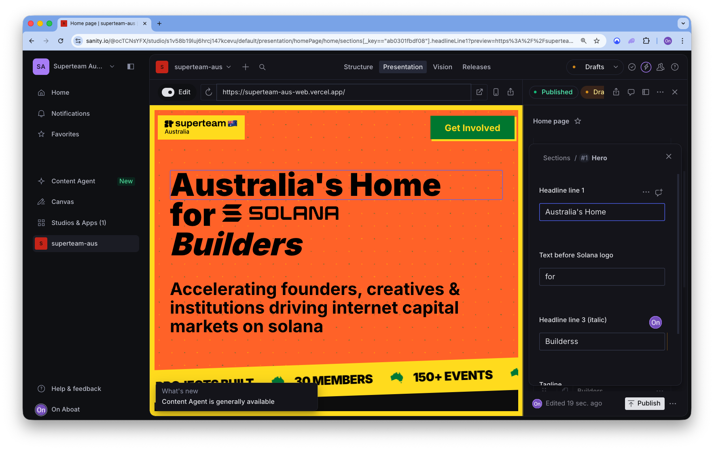
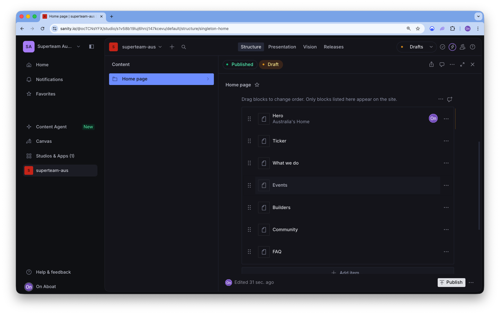
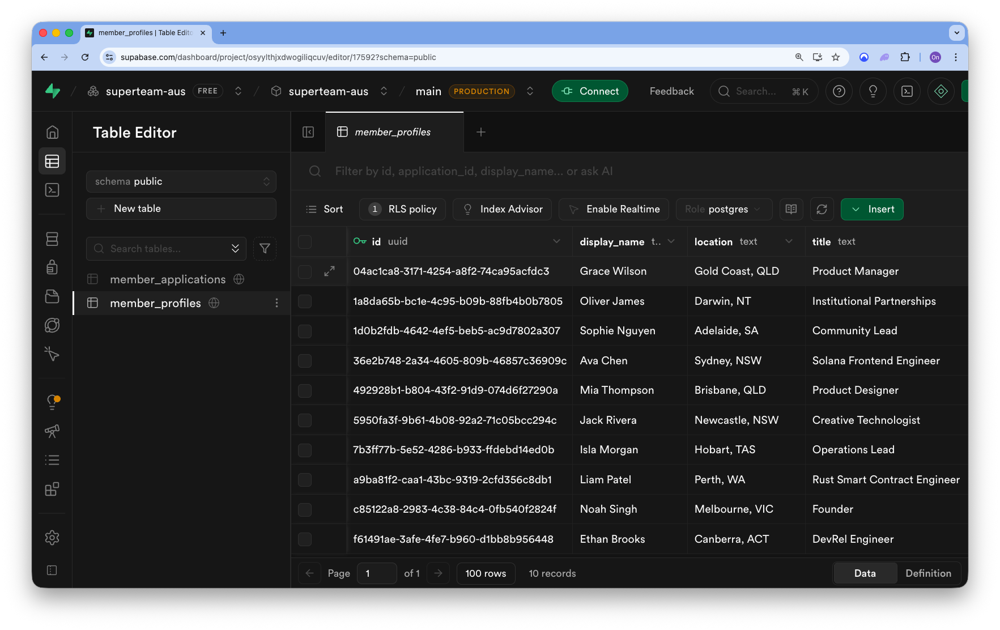

# Superteam Australia — Website

**Open Challenge Submission** for the official Superteam Australia website.

---

## Deliverables

| Deliverable | Link |
|-------------|------|
| **Live Demo** | [superteam-aus-web.vercel.app](https://superteam-aus-web.vercel.app/) |
| **Figma Prototype** | [View Design](https://www.figma.com/proto/NddY9YQxw9N7p0VbyNUKhZ/super-team-aus-website?node-id=36-53529&viewport=-321%2C-656%2C0.06&t=s4yfM4pKrHMp9ai6-1&scaling=min-zoom&content-scaling=fixed&page-id=0%3A1) |
| **GitHub Repository** | This repo |
| **Documentation** | This README |
| **Sanity Studio** | [CMS Dashboard](https://www.sanity.io/@ocTCNsYFX/studio/s1v58b19luj6hrcj147kcevu/default/structure) |

---


---

## Overview

A production-oriented marketing site for **Superteam Australia** — the Solana builder community in Australia — with editorial control through a headless CMS and real member data on **Supabase**.

This README is the submission overview: what we built, how operators run it, and how it lines up with the challenge.

## What we shipped

We treated this as a small product: **clear story on the landing page**, **structured onboarding**, and a **searchable member directory** backed by Postgres — not a static brochure.

- **Landing experience** — Hero, impact ticker, mission / “what we do”, events (Luma calendar + “view all”), builders spotlight, community strip, FAQ, and footer — with optional **Sanity-driven section order** when a home document is published.
- **Get Involved** — Multi-step flow at `/get-involved` with validation; submissions persist to Supabase (`member_applications`) via server-side actions.
- **Members** — `/members` directory with search and skill filters over **published** profiles (`member_profiles`); operators approve and publish from Supabase (see [docs/get-involved-member-directory-plan.md](docs/get-involved-member-directory-plan.md)).
- **Brand & UX** — Responsive layout, Superteam AU art direction, navigation to Members, FAQ, and the public **Luma** calendar for events.
- **CMS & database** — **Sanity** for editable home content and studio workflow; **Supabase** for API keys, RLS-friendly client access, and server-only intake writes.

If Sanity returns no home layout, the app uses the **default section stack** in `app/page.tsx` so the site always renders.

## Website features

### Home page (`/`)

| Area | What it does |
|------|----------------|
| **Hero** | Large headline with Solana wordmark, supporting tagline, and a canvas-style **Australian** background treatment (`HeroAusEffect`). Copy can be overridden from Sanity when the home document includes a `heroSection`. |
| **Impact ticker** | Horizontally scrolling strip with highlight stats (members, events, projects) and AU iconography — sits directly under the hero for energy and motion. |
| **What we do** | Mission copy plus five pillars (builder support, capital, growth, talent, institutional engagement) in a readable, editorial layout. |
| **Events** | “Join us at upcoming events” with stat tiles (e.g. events hosted, cities), a **timeline** of event cards (date, time, title, host, location with virtual vs physical icons, tags, thumbnail) — currently **curated demo data** in the component. The **navbar** links to the public **Luma** calendar (`lib/luma.ts` → `LUMA_CALENDAR_URL`). `getLumaUpcomingEvents()` in `lib/luma.ts` is ready to pull live listings when **`LUMA_API_KEY`** is set and you wire it into the UI. |
| **Builders** | Home “Australian Solana Builders” grid: up to **7 featured** published profiles from Supabase when read credentials are set; **loading skeleton** while fetching; if the database is empty but configured, a dashed callout explains how listings get published and links to Get Involved + full directory; if Supabase isn’t configured for reads, **curated mock cards** keep the section demo-ready. |
| **Community** | X/Twitter-style **social proof** section (curated post layout with avatars, links, quoted tweets) to mirror ecosystem activity. |
| **FAQ** | Accordion (**Radix-style**) with four questions covering what ST AU is, how to get involved, opportunities, and institutions. |
| **Partners** | "Ecosystem & Partners" grid showcasing partner logos — grayscale by default, colorful on hover. Configurable via `lib/config/partners.ts`; renders nothing when empty. |
| **Footer** | Superteam AU logo, **Navigate** (About, Members, FAQ, Get Involved), **Community** (X, Telegram, Luma placeholders), **Ecosystem** (global Superteam, Solana, Earn), plus layout tuned for the brand palette. |

**Sanity-controlled home:** When a Sanity `home` document defines `sections`, `PageSections` renders the same building blocks in **editor-chosen order** (`heroSection`, `tickerSection`, `whatWeDoSection`, `eventsSection`, `buildersSection`, `communitySection`, `faqSection`, `partnersSection`, `joinCtaSection`). Unknown block types are ignored with a console warning.

**SEO & previews:** Root `metadata` sets title and description; home uses ISR-style **`revalidate = 60`**. Root layout includes **Sanity Live** and, in **draft mode**, Visual Editing overlay plus a control to exit draft.

### Global chrome

- **Navbar** — Persistent on inner pages; logo home link; desktop nav to About (`/#about`), **Events** (opens the [Luma calendar](https://luma.com/SuperteamAU) in a new tab), **Members** (`/members`), **FAQ** (`/#faq`); primary **Get Involved** button.
- **Responsive design** — Mobile-first spacing, typography scale, and grids (e.g. builders grid collapses from 7 columns on large screens to 2 on small).

### Get Involved (`/get-involved`)

- **Four-step wizard** with visible progress chips: *About you* → *Role & focus* → *Skills & links* → *Goals & send*.
- **Step 1:** Name and location (with sensible `autocomplete` hints).
- **Step 2:** Role picker (Builder, Designer, Founder, Creative, Operator, Institution) and **experience level** (learning → lead).
- **Step 3:** Multi-select **skill tags** aligned with the directory filters (Core Team, Rust, Frontend, Design, Content, Growth, Product, Community); optional **X/Twitter**, **GitHub**, **portfolio** URLs.
- **Step 4:** Read-only **review** summary plus free-text “what are you looking for” (minimum length enforced per step).
- **Validation:** Per-step checks in the client plus **Zod** (`getInvolvedSchema`) on submit; errors surface inline.
- **Persistence:** `submitMemberApplication` server action writes to **`member_applications`** using the **service role** key (never exposed to the browser).
- **Success state:** Confirmation panel (“You’re on the list”) explaining manual review and directory publishing.

### Members (`/members`)

- **Search** across name, location, title, company, skills, filters, and “looking for” text.
- **Filter chips** for the same skill areas as intake — multiple filters combine (member must match at least one selected tag).
- **Member cards:** Square avatar (image or initial fallback), name, title, company, up to four skill chips, **X/Twitter** link with `@handle`-style label when possible; **hover** lift and shadow for polish.
- **Empty state:** If there are no published profiles, messaging explains the approval model and links to **Get Involved**.

### Content & data (summary)

| Concern | Implementation |
|--------|------------------|
| **Marketing copy & section order** | Sanity documents + studio (`studio-superteam-aus/`). |
| **Applications & directory rows** | Supabase tables, RLS; public reads only for **`published`** profiles. |
| **Featured builders on home** | `getFeaturedProfiles(7)` from `lib/data/members`. |

## CMS & data layer (screenshots)

Headless CMS (**Sanity**) for landing copy and blocks:





**Supabase** project (API + database) backing applications and the public directory:



## Stack

| Layer | Choice |
|-------|--------|
| Frontend | Next.js (App Router), React, TypeScript, Tailwind CSS, shared UI primitives under `components/ui/` |
| Content | Sanity (`lib/sanity/`, studio in `studio-superteam-aus/`) |
| Data | Supabase (Postgres, RLS; service role for secure intake) |
| Events | Luma — public calendar URL and optional API integration (`lib/luma.ts`, `LUMA_API_KEY` for live listings) |

This repo tracks a **current-generation Next.js** release. If an API surprises you versus older docs, prefer `node_modules/next/dist/docs/` in this project.

---

## Design Rationale

### Visual Identity

The design bridges the **global Superteam brand** with a distinct **Australian identity**:

- **Color palette** — Superteam's signature yellow/green primary with dark backgrounds, maintaining brand consistency across the global network
- **Typography** — Bold, confident headings that mirror the energy of other Superteam chapters while feeling fresh
- **Australian elements** — Subtle canvas-style background treatment in the hero (`HeroAusEffect`) evokes the Australian landscape without being literal or cliché
- **Solana integration** — The Solana wordmark is embedded directly in the hero headline, reinforcing the ecosystem connection

### Information Architecture

The site is structured to serve multiple audiences:

1. **Builders & developers** — Clear pathways to Get Involved, skill-based member filtering, events calendar
2. **Founders** — Mission clarity, capital/fundraising messaging, talent discovery
3. **Institutions** — Professional presentation, clear FAQ about engagement, credible ecosystem partners
4. **Creatives & operators** — Visible role representation in onboarding, diverse skill tags in directory

### Platform Philosophy

This isn't a static brochure — it's a **living platform**:

- **Structured onboarding** captures member data that can power matching, outreach, and ecosystem analytics
- **Approval workflow** ensures quality control before profiles go public
- **CMS-driven content** lets operators update messaging without deployments
- **Modular sections** can be reordered or extended as the chapter evolves

---

## How this maps to the challenge

### Landing Page Requirements

| Requirement | Implementation |
|-------------|----------------|
| **Hero Section** | Large headline, Solana wordmark, Australian background treatment, clear CTAs |
| **Mission / What We Do** | Six pillars: Builder Support, Capital, Growth, Talent, Ecosystem, Institutional |
| **Stats / Impact** | Animated ticker with members, events, projects counts |
| **Events** | Timeline cards with Luma integration, virtual/physical indicators, tags |
| **Members / Talent** | Featured builders grid on home, full directory at `/members` |
| **Ecosystem / Partners** | Logo grid with hover effects, configurable via `lib/config/partners.ts` |
| **Community** | X/Twitter-style social proof section with embedded posts |
| **FAQ** | Radix accordion with four core questions |
| **Join CTA** | Links to Telegram, Discord, X/Twitter |
| **Footer** | Logo, navigation, community links, ecosystem links |
| **Get Involved Form** | Multi-step wizard with validation, Supabase persistence |

### Members Page Requirements

| Requirement | Implementation |
|-------------|----------------|
| **Search & Filter** | Full-text search + skill-based filter chips |
| **Skill Filters** | Core Team, Rust, Frontend, Design, Content, Growth, Product, Community |
| **Member Cards** | Photo, name, title, company, skills, X/Twitter link |
| **Animations** | Hover lift effects, smooth transitions |

### Technical Requirements

| Requirement | Implementation |
|-------------|----------------|
| **Next.js + React** | Next.js 16, React 19, App Router |
| **Tailwind CSS** | Fully responsive, mobile-first |
| **Supabase** | Members database, applications, RLS policies |
| **Luma Integration** | Calendar URL + optional API for live listings |
| **CMS** | Sanity with admin studio, role-based access |
| **SEO** | Metadata, ISR revalidation, semantic HTML |


## Run locally

**Prerequisites:** Node.js 20+, npm.

```bash
git clone <repository-url>
cd aus-superteam
npm install
cp .env.example .env.local
```

Fill `.env.local` (Supabase URL + anon key + `SUPABASE_SERVICE_ROLE_KEY` for intake; Sanity keys if you use CMS; optional `LUMA_API_KEY` for live Luma listings). Then:

```bash
npm run dev
```

Open [http://localhost:3000](http://localhost:3000).

### Environment variables (summary)

| Variable | Role |
|----------|------|
| `NEXT_PUBLIC_SUPABASE_URL`, `NEXT_PUBLIC_SUPABASE_ANON_KEY` | Browser-safe Supabase client |
| `SUPABASE_SERVICE_ROLE_KEY` | **Server only** — Get Involved inserts |
| `NEXT_PUBLIC_SANITY_*`, `SANITY_*` | Sanity content |
| `LUMA_API_KEY` | Optional — upcoming events from Luma API |

Full detail and database migration paths are unchanged from the project runbook below.

---

## Operator & developer reference

### Supabase

1. Create or use a project at [supabase.com](https://supabase.com).
2. Apply schema: `npm run db:migrate` (with `SUPABASE_DATABASE_URL` in `.env.local` if using the script), or run `supabase/migrations/20260413120000_member_intake.sql` in the SQL Editor, or use `npm run db:push` with the CLI.
3. Copy **Project URL**, **anon** key, and **service_role** from **Project Settings → API** into `.env.local`.

Intake: `member_applications`. Public directory: `member_profiles` with `published = true`. Approvals are done in the **Supabase Dashboard** unless you add a custom admin app.

### Sanity

- Fetching and preview: `lib/sanity/`.
- Studio: `studio-superteam-aus/` — see [studio-superteam-aus/README.md](studio-superteam-aus/README.md).

### Scripts

| Command | Description |
|---------|-------------|
| `npm run dev` | Dev server |
| `npm run build` / `npm run start` | Production build / local prod |
| `npm run lint` | ESLint |
| `npm run db:migrate` | Apply migration via script |
| `npm run db:seed:members` | Seed member profiles (when configured) |

### Routes

| Path | Purpose |
|------|---------|
| `/` | Home |
| `/get-involved` | Onboarding → `member_applications` |
| `/members` | Published member directory |

### Brand reference (global Superteam family)

[superteam.fun](https://superteam.fun) · [UAE](https://uae.superteam.fun) · [DE](https://de.superteam.fun) · [US](https://us.superteam.fun)

### Deploy

Mirror `.env.local` on the host (e.g. Vercel): public **anon** key only in client-exposed vars; **`SUPABASE_SERVICE_ROLE_KEY`** server-only.

---

## Architecture

```
┌─────────────────────────────────────────────────────────────────┐
│                         FRONTEND                                │
│                   Next.js 16 (App Router)                       │
│  ┌─────────────┐  ┌─────────────┐  ┌─────────────────────────┐  │
│  │  Landing    │  │  Members    │  │  Get Involved           │  │
│  │  Page (/)   │  │  (/members) │  │  (/get-involved)        │  │
│  └─────────────┘  └─────────────┘  └─────────────────────────┘  │
└────────────────────────┬────────────────────────────────────────┘
                         │
         ┌───────────────┼───────────────┐
         ▼               ▼               ▼
┌─────────────┐  ┌─────────────┐  ┌─────────────┐
│   SANITY    │  │  SUPABASE   │  │    LUMA     │
│   (CMS)     │  │  (Database) │  │   (Events)  │
├─────────────┤  ├─────────────┤  ├─────────────┤
│ • Home page │  │ • member_   │  │ • Calendar  │
│   content   │  │   profiles  │  │   URL       │
│ • Section   │  │ • member_   │  │ • Event API │
│   ordering  │  │   applica-  │  │   (optional)│
│ • Editorial │  │   tions     │  │             │
│   studio    │  │ • RLS       │  │             │
└─────────────┘  └─────────────┘  └─────────────┘
```

### Data Flow

1. **Content** — Sanity serves editable marketing copy and section configuration
2. **Applications** — Get Involved form → server action → Supabase `member_applications`
3. **Directory** — Operators approve applications → `member_profiles` with `published=true` → public directory
4. **Events** — Luma calendar for official events, optional API for live listings

---

Built with [Next.js](https://nextjs.org/docs).
